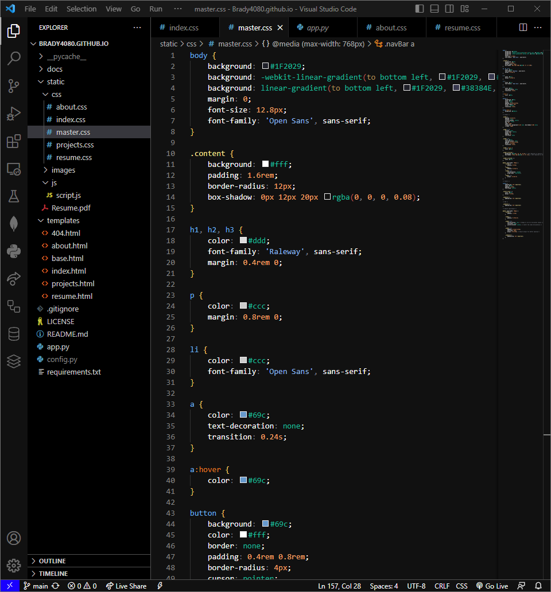

# Broken Moon Theme 
A Dark Mode Theme for Visual Studio Code

[Broken Moon](https://github.com/Brady4080/Broken-Moon/) is a meticulously crafted dark theme designed to elevate your development experience across various platforms. With its intuitive design, soothing color palette, and meticulous attention to detail, Broken Moon transforms your coding environment into a visually pleasing and efficient workspace.

## Colors Used

| Usage           | Hex Code                                                           |
| --------------- | ------------------------------------------------------------------ |
| Background      |  `#111111` |
| Comment         |  `#777c85` |
| Foreground      |  `#fca369` |
| Function        |  `#ffffff` |
| Variable        |  `#fca369` |
| Number          |  `#fca369` |
| Attribute       |  `#f7e392` |
| Keyword         |  `#f7e392` |
| String          |  `#8cb8f1` |
| Class/Tag       |  `#6ab0f3` |
| Support         |  `#1ABC9C` |
| Operator        |  `#ac8d58` |

## Screenshots

### Demo Picture

